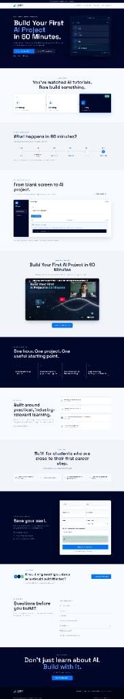
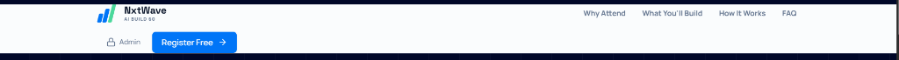

# NxtWave Growth Challenge – Full Stack Application & Acquisition Engine

A production-grade, measurement-focused web application and growth acquisition engine engineered for the NxtWave Growth Challenge. The project features a high-converting landing page for a 60-minute AI project workshop, a dual-channel verification system (1-Click Magic Link and 6-digit OTP), an acquisition budget optimization engine, and an authenticated real-time growth analytics dashboard.



---

## Executive Overview & Core Objectives

The primary goal of this application is to maximize verified user registrations for NxtWave's 60-minute AI workshop while reducing funnel friction, preventing duplicate registrations, and enabling data-driven acquisition budget allocation.

### 1. Acquisition Engine Optimization
The application tracks registration traffic across key acquisition channels:
* WhatsApp Student Communities
* College Student Communities & Campus Leads
* Paid Amplification (Social Media Ads)
* Direct / Organic Traffic

The system evaluates conversion efficiency in real-time and provides data-driven recommendations to allocate a ₹2,000 acquisition budget toward the highest-converting traffic source.

### 2. Reduced Verification Friction (1-Click Magic Link & OTP)
To eliminate conversion drop-offs caused by email OTP entry:
* **1-Click Magic Link**: Users receive a direct verification link (`?token=...`) in their email that completes registration in one click without manual code entry.
* **Fallback 6-Digit OTP**: Traditional OTP verification remains available as a secondary fallback.
* **Security & Clean URLs**: Magic tokens are single-use, short-lived, and automatically stripped from the browser URL bar upon successful verification (`window.history.replaceState`).

### 3. Authenticated Growth & Analytics Dashboard (`/admin`)
An authenticated management console providing real-time visibility into growth metrics:
* **KPI Summary**: Total verified registrations, daily signups, conversion rates (started to verified), referral share rates, and referral contributions.
* **Demographic Breakdown**: Registration distribution across colleges and academic branches.
* **Acquisition Engine Optimization**: Dynamic ₹2,000 budget re-allocation calculations.
* **Friction Analysis**: Adoption metrics comparing 1-Click Magic Link vs. 6-digit OTP completion times.
* **CSV Data Export**: Secure streaming CSV export (`/api/v1/admin/export-csv`) for offline data processing.
* **Safe Demo Simulation Mode**: Idempotent synthetic dataset generation (85 demo records) isolated from real campaign records with an explicit `SIMULATION DATA — DEMO ONLY` indicator.



---

## Technical Architecture & System Design

The application follows a decoupled client-server architecture with serverless deployment readiness.

```
[ React 18 / Vite Frontend ]
        │
        ▼ (HTTPS REST API / JSON)
[ FastAPI Backend Service ]
        │
        ├── Upstash Redis REST API (Distributed Rate Limiting)
        ├── Gmail SMTP Provider (OTP & Confirmation Emails)
        └── SQLAlchemy ORM Layer
                │
                ▼
      [ PostgreSQL / SQLite Database ]
```

### Key Technical Subsystems

1. **Email Normalization & Duplicate Registration Handling**:
   * All incoming emails pass through a unified normalization function (leading/trailing whitespace trimmed, converted to lowercase).
   * Enforced via database-level `UNIQUE` index constraints on normalized email addresses and referral codes.
   * Prevents repeated verification attempts from generating duplicate database rows or sending repeated confirmation emails while idempotently returning existing referral codes.

2. **Security & Authentication Protocol**:
   * Admin authentication utilizes short-lived (1-hour) HMAC-SHA256 signed session tokens derived from environment secrets (`ADMIN_PASSWORD` / `ADMIN_SESSION_SECRET`).
   * API endpoints enforce strict Content-Security-Policy (CSP), HTTP Strict Transport Security (HSTS), X-Content-Type-Options, and X-Frame-Options headers.
   * Rate limiting is enforced via Upstash Redis with a sliding-window in-memory fallback to prevent brute-force attacks on admin login and OTP generation endpoints.

---

## Technology Stack

### Frontend
* **Core Framework**: React 18 with TypeScript
* **Build Tooling**: Vite 5
* **Styling**: TailwindCSS with CSS custom properties
* **Iconography & UI**: Lucide React, Radix UI primitives
* **Router & State**: TanStack Query / React Router

### Backend
* **API Framework**: FastAPI (Python 3.14 / 3.11+)
* **Data Persistence**: SQLAlchemy ORM with PostgreSQL (Production) / SQLite (Development)
* **Rate Limiting**: Upstash Redis REST API / Hybrid Memory Limiter
* **Authentication & Cryptography**: HMAC-SHA256, Python `hashlib` & `secrets`
* **Email Dispatch**: Standard SMTP / Custom Email Provider Integration

---

## Environment Variables Configuration

### Frontend Configuration (`Frontend/.env`)

| Variable | Type | Description |
| :--- | :--- | :--- |
| `VITE_API_BASE_URL` | String | Base REST API URL (e.g. `/api/v1` or external domain) |
| `VITE_USE_MOCK_API` | Boolean | Set to `false` for live backend integration |

### Backend Configuration (`Backend/.env`)

| Variable | Type | Description |
| :--- | :--- | :--- |
| `APP_ENV` | String | Application environment (`development` / `production`) |
| `DATABASE_URL` | String | Database connection URI (PostgreSQL or SQLite) |
| `ADMIN_PASSWORD` | String | Password for admin dashboard authentication |
| `ADMIN_SESSION_SECRET` | String | Secret key for signing HMAC session tokens |
| `UPSTASH_REDIS_REST_URL` | String | Optional Upstash Redis REST API endpoint for distributed rate limiting |
| `UPSTASH_REDIS_REST_TOKEN` | String | Optional Upstash Redis authentication token |
| `SMTP_SERVER` | String | SMTP host (e.g. `smtp.gmail.com`) |
| `SMTP_PORT` | Integer | SMTP port (e.g. `587`) |
| `SMTP_USERNAME` | String | Sender email address |
| `SMTP_PASSWORD` | String | App-specific SMTP password |

---

## Local Development & Setup

### Prerequisites
* Python 3.10+
* Node.js 18+ and npm

### 1. Backend Setup
```bash
cd Backend
python -m pip install -r requirements.txt
python -m uvicorn app.main:app --host 0.0.0.0 --port 8000
```
* API Base URL: `http://localhost:8000`
* Interactive API Documentation (Swagger): `http://localhost:8000/docs`

### 2. Frontend Setup
```bash
cd Frontend
npm install
npm run dev
```
* Application URL: `http://localhost:5173`

---

## Verification & Automated Test Suite

To run the full backend unit test suite (32 tests covering OTP verification, duplicate registration handling, admin authentication, rate limiting, and demo mode isolation):

```bash
cd Backend
python -m pytest -v
```

To build the production frontend bundle:

```bash
cd Frontend
npm run build
```

---

## Production Deployment Architecture

The repository is configured for direct deployment on Vercel:
* **Frontend Build Command**: `cd Frontend && npm install --ignore-scripts=false && npm run build`
* **Output Directory**: `Frontend/dist`
* **Serverless Functions**: Serverless Python execution via `/api/index.py` rewrite rules.
